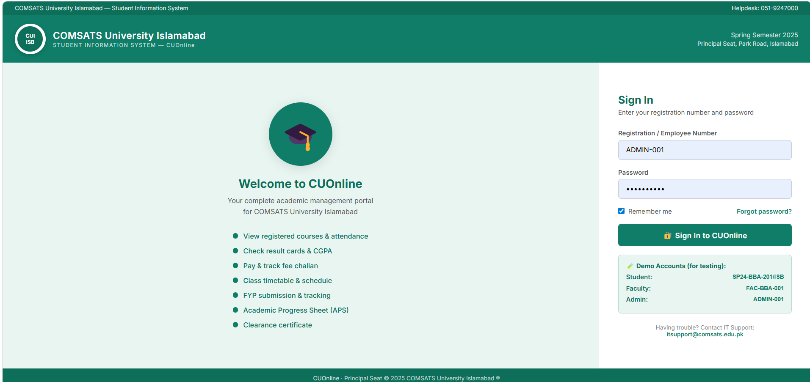
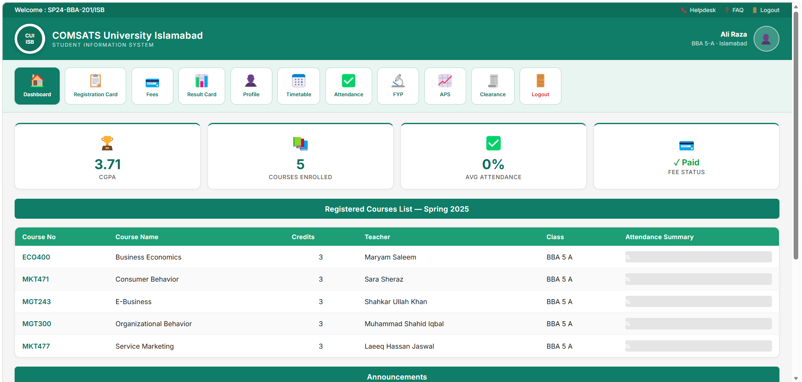
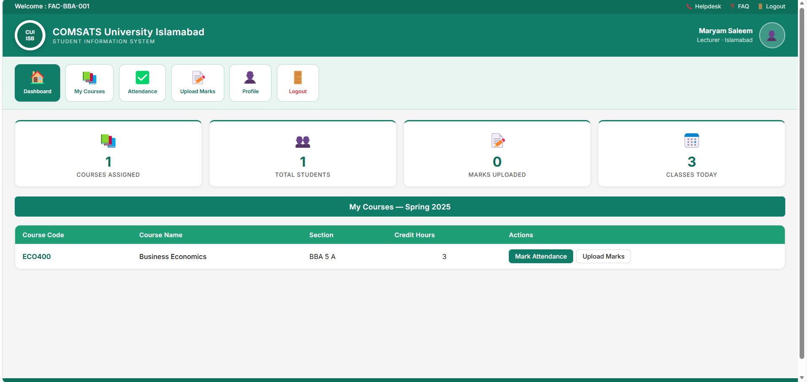
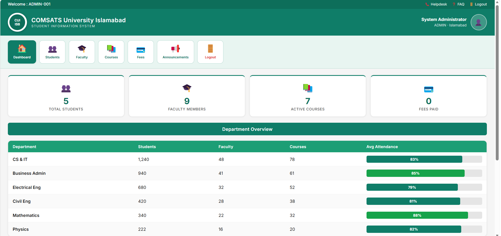
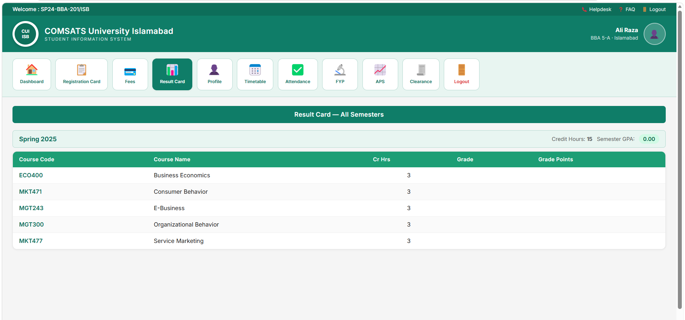
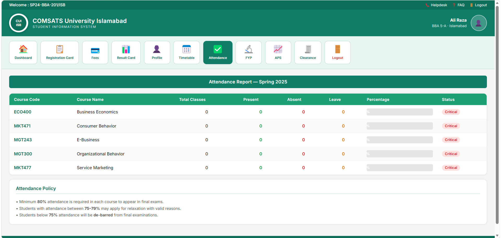

# University Portal CUOnline 🎓

A full-stack university management portal inspired by COMSATS CUOnline, built using the MERN Stack.

This platform provides role-based access for:
- Students
- Faculty
- Administrators

The system manages:
- Attendance
- Courses
- Fee records
- Marks
- FYP management
- Announcements
- AI chatbot support

---

# Features ✨

## Student Portal
- Student Dashboard
- Attendance Tracking
- Fee Management
- Course Enrollment
- Academic Records
- GPA/CGPA Display
- Announcements
- FYP Details

## Faculty Portal
- Manage Courses
- Upload Attendance
- Upload Marks
- Student Management

## Admin Portal
- User Management
- Course Management
- Reports & Analytics
- System Monitoring

## AI Features
- AI Chatbot Assistant
- Smart Academic Support
- Automation Features

---

# Tech Stack 🛠️

## Frontend
- React.js
- CSS
- Axios

## Backend
- Node.js
- Express.js

## Database
- MongoDB

## Authentication
- JWT Authentication

---

# Installation ⚙️

## Clone Repository

```bash
git clone https://github.com/YOUR_USERNAME/university-portal-cuonline.git
```

---

# Backend Setup

```bash
cd backend
npm install
npm run dev
```

---

# Frontend Setup

```bash
cd frontend
npm install
npm start
```

---

# Demo Login Credentials 🔐

## Admin
Registration Number:
```bash
ADMIN-001
```

Password:
```bash
Admin@1234
```

---

## Student
Registration Number:
```bash
SP24-BBA-201/ISB
```

Password:
```bash
Student@1234
```

---

## Faculty
Registration Number:
```bash
FAC-BBA-001
```

Password:
```bash
Faculty@1234
```

#

# 📸 Screenshots

## Login Page



---

## Student Dashboard



---

## Faculty Dashboard



---

## Admin Dashboard



---

## Result Card



---

## Attendance



---

# Project Status 🚧

This project is currently under development and built for learning, portfolio, and demonstration purposes.

---

# Future Improvements 🚀

- Real-time notifications
- AI GPA prediction
- Smart timetable generator
- Online assignments
- PDF transcript generation
- AI academic assistant
- Cloud deployment

---

# Repository Details 📂

Name:
`university-portal-cuonline`

Description:
`Full-stack university management portal (COMSATS CUOnline style) - MERN Stack`

Topics:
- mern-stack
- nodejs
- react
- mongodb
- jwt
- university-portal
- expressjs

---

# Author 👨‍💻

Abdullah Basit